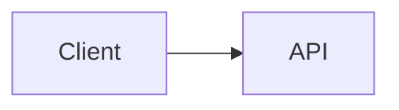

<div align="center">

# 🚀 MarkdownFly (mfly)

**Markdown to PowerPoint (.pptx) — the CLI tool built for developers.**  
Write slides in Markdown with syntax-highlighted code and embedded diagrams.  
Generate beautiful, fully editable `.pptx` in seconds.

[](https://www.npmjs.com/package/markdownfly)
[](https://www.npmjs.com/package/markdownfly)
[](./LICENSE)
[](https://nodejs.org)

[English](./README.md) · [简体中文](./README_CN.md)

</div>

---

<details>
<summary>📖 Table of Contents</summary>

- [✨ Features](#-features)
- [📦 Installation](#-installation)
- [🚀 Quick Start](#-quick-start)
- [🎨 Built-in Themes](#-built-in-themes)
- [📝 Markdown Syntax Guide](#-markdown-syntax-guide)
  - [Slide Splitting Rules](#slide-splitting-rules)
  - [Frontmatter](#frontmatter)
  - [In-Slide Layout (Grid)](#in-slide-layout-grid)
  - [Slide Directives](#slide-directives-)
  - [Callouts](#callouts)
  - [Task Lists](#task-lists)
  - [Images](#images)
  - [Code Blocks with Syntax Highlighting](#code-blocks-with-syntax-highlighting)
  - [Diagram Code Blocks](#diagram-code-blocks)
  - [Footnotes](#footnotes)
- [🧪 Testing](#-testing)
- [🤔 Why MarkdownFly?](#-why-markdownfly)
- [⭐ Star History](#-star-history)
- [📄 License](#-license)

</details>

---

## ✨ Features

- 📑 **Markdown to PowerPoint**: Convert standard Markdown to editable 16:9 widescreen `.pptx` slides.
- 🎨 **Syntax Highlighting**: Token-level code highlighting powered by [Shiki](https://shiki.style/) (Python, TypeScript, Go, Rust, Java, C++, Bash, SQL, and 20+ languages).
- 📊 **Built-in Diagram Rendering (Zero native binary dependencies)**:
  - **Mermaid**: Flowcharts, sequence diagrams, state diagrams, class diagrams.
  - **Graphviz / DOT**: Network graphs, finite state machines, architecture topologies (via WASM).
  - **PlantUML**: Sequence, class, activity, state, component and use-case diagrams (TeaVM-compiled engine — no JVM required).
  - **ECharts**: Bar charts, line charts, pie charts directly from JSON options (via ECharts SSR).
- 🖼️ **Image Embedding**: Local file paths, remote URLs (`http://`/`https://`), and base64 Data URIs.
- 📐 **Automatic Layout Detection**: Title slides, section dividers, code spotlights, quotes, and content slides.
- ⚡ **Batch Conversion**: Convert multiple files with glob support (`mfly *.md`).

---

## 📦 Installation

Requires Node.js 20+.

```bash
# Install globally from npm (preferred)
npm install -g markdownfly

# Or run without installing
npx markdownfly@latest slides.md
```

Develop from source:

```bash
# Clone and install dependencies
git clone https://github.com/Kyvin-Guan/markdownFly.git
cd markdownFly
pnpm install
pnpm build
```

Link locally for global CLI access:
```bash
pnpm link --global
```

---

## 🚀 Quick Start

### Basic Usage

```bash
# Convert a single file (named after the input: slides.md → slides.pptx)
mfly slides.md

# Specify color-scheme theme (ocean, ocean-dark)
mfly slides.md -t ocean-dark

# Specify custom output path
mfly slides.md -t ocean -o presentation.pptx

# Batch convert multiple Markdown files
mfly docs/*.md
```

If the default output name already exists, a timestamped name is used
(`slides-20260907-131500.pptx`) instead of overwriting. With `-o` the target
is overwritten without prompting.

### Automation (`--quiet` / `--json`)

```bash
# Machine-readable result (one JSON line on stdout; diagnostics on stderr)
mfly slides.md --json

# Suppress per-file progress lines
mfly docs/*.md --quiet
```

- `--json` prints a single JSON object to stdout:
  `{"ok":true,"durationMs":1234,"files":[{"input":"slides.md","output":"C:/abs/slides.pptx","ok":true}]}`.
  Per-file failures set `ok:false` with an `error` field.
- Exit code is `0` only when **every** file converts successfully; if any file
  fails the process exits `1` (a summary line is printed to stderr).
- `-t` with an unknown scheme name fails with exit `1` (unknown scheme names in
  markdown frontmatter fall back to `ocean` with a warning).
- Progress lines go to stderr; errors and warnings always go to stderr.

---

## 🎨 Built-in Themes (ColorScheme)

Themes are generated from a four-slot color scheme: `ink` (text) / `paper`
(background) / `primary` (decoration) / `secondary` (auxiliary). The legacy 12
hard-coded themes have been removed; layout rendering is unchanged and will be
extended later via a layout-set system.

| Scheme | Mode | ink / paper | primary / secondary | Best For |
| :--- | :--- | :--- | :--- | :--- |
| **`ocean`** *(default)* | Light | Deep sea ink `#1E4A6F` / Sea-foam paper `#F0F8FF` | Bright blue `#4F9FD9` / Mid blue `#2D6A9F` | General tech talks, product intros |
| **`ocean-dark`** | Dark | Light foam `#D6E7F5` / Deep sea `#0B1C2E` | Lifted blue `#5BAAE8` / `#8BBCDD` | Night sessions, dark decks |

Register more schemes via the library API `registerColorScheme` /
`createThemeFromScheme`.

---

## 📝 Markdown Syntax Guide

### Slide Splitting Rules

- `---` (Horizontal Rule): Primary slide separator.
- `# Heading 1`: Creates a new slide with **Title** (cover) layout.
- `## Heading 2`: Creates a new slide with **Content** or **Section** layout.

### Frontmatter

```yaml
---
theme: ocean-dark # Options: ocean, ocean-dark (ColorScheme names)
author: "Your Name"
footer: "Confidential - {page} / {total}" # {page}/{total}/{section}/{title}
resource_dir: ./assets # Base directory for relative image paths
layout: code # Optional default layout for content slides
---
```

### In-Slide Layout (Grid)

Split a slide into columns and rows with standalone lines — no extra markup:

````markdown
## Architecture Overview

### Architecture Diagram

<->                   <!-- two columns: diagram on the left -->

### Key Points
- Low latency
- Horizontally scalable
- Cost-efficient
===                   <!-- stacked rows: what follows starts a new row -->

### Summary
> [!TIP]
> `===` splits a slide into stacked rows — handy for before/after comparisons.
````

- `<->` (standalone line): horizontal separator → **columns** (side-by-side).
- `===` (standalone line): vertical separator → **rows** (stacked).
- Combine both for grids. Markers inside code blocks are never rewritten.

### Slide Directives `@(...)`

A standalone `@(key=value, ...)` line at the bottom of a slide sets per-slide options:

```markdown
## Table to Chart

| Quarter | Orders |
| :--- | :--- |
| Q1 | 320 |
| Q2 | 580 |

@(chart=bar, notes=expand on the Q1-Q2 numbers here)
```

| Directive | Value | Effect |
| :--- | :--- | :--- |
| `layout` | `title` / `section` / `content` / `code` / `quote` | Override auto-detected layout |
| `notes` | text | Speaker notes for this slide |
| `chart` | `bar` / `line` / `pie` | Render the first table as a chart |
| `highlight` | `2-4,6` | Highlight lines in the slide's code block |
| `background` | URL/path | Slide background image |
| `steps` | `true` | Progressive reveal (reserved) |

### Callouts

```markdown
> [!NOTE]
> Important point to remember.

> [!TIP]
> Helpful suggestion.

> [!WARNING]
> Watch out for this.
```

Supported variants: `NOTE` / `INFO` / `TIP` / `SUCCESS` / `WARNING` / `CAUTION` / `DANGER` — rendered as theme-styled accent cards.

### Task Lists

```markdown
- [x] Completed item
- [ ] Upcoming item
```

### Images

A standalone image line renders as a slide element (aspect ratio preserved, centered in its column). Paths are resolved relative to the markdown file, or relative to `resource_dir` (which itself is resolved relative to the markdown file, never the current working directory); remote URLs (`http/https`) and base64 data URIs also work. A missing or failed image is skipped with a warning on stderr — the deck is still generated.

```markdown
{w=6in,align=center}
{w=60%}
{width=120px,height=40mm,align=right}
```

- Keys: `w`/`width`, `h`/`height`, `align` (`left`/`center`/`right`, default `center`)
- Units: `px` (default), `pt`, `cm`, `mm`, `in`/`inch`, `%` (relative to the column; single value preserves aspect ratio)
- Invalid params are silently ignored — the image still renders
- Formats: `png`, `jpg`/`jpeg`, `gif`, `webp`, `bmp`, `svg`. Alt text carries into the PPTX, so `` is what a screen reader announces.
- ⚠ `webp` is stored faithfully but not every reader decodes it — PowerPoint for the web and Office 2019 and earlier show a broken image. A warning is printed on stderr.
- `svg` is rasterized to a PNG (1200px wide) as it is embedded, so it renders the same in every reader. The author's own framing is kept, including any padding built into the viewBox. The trade-off: the deck carries a raster rather than a vector, so it no longer scales losslessly, and SVG-heavy decks get larger.
- ⚠ Security: image paths (`` and `@(background=...)`) are resolved without restrictions — only convert markdown you own or trust.

### Code Blocks with Syntax Highlighting

`````markdown
````typescript
interface User {
  id: string;
  name: string;
}

function greet(user: User): string {
  return `Hello, ${user.name}!`;
}
````
`````

`````markdown
````python
def quick_sort(arr): ...
````
@(highlight=1,3-4)   <!-- highlight specific lines -->
`````

### Diagram Code Blocks

`````markdown
````mermaid
graph TD
    A[Client] --> B[API Gateway]
    B --> C[Auth Service]
    B --> D[Data Service]
````

````dot
digraph Architecture {
    rankdir=LR;
    node [shape=box, style=filled, fillcolor=lightblue];
    Frontend -> Backend -> Database;
}
````

````echarts
{
  "xAxis": { "type": "category", "data": ["Q1", "Q2", "Q3", "Q4"] },
  "yAxis": { "type": "value" },
  "series": [{ "data": [150, 230, 224, 218], "type": "bar" }]
}
````

````plantuml
@startuml
Alice -> Bob : login request
Bob --> Alice : login OK
@enduml
````
`````

Accepted diagram languages: `mermaid`, `dot` (alias `graphviz`), `echarts`, `plantuml` (alias `puml`).
Diagram slides follow the presentation theme, including its dark palette.

PlantUML notes:

- The `@startuml`/`@enduml` envelope is optional — bare source is wrapped for you, and an unclosed `@startuml` is closed automatically.
- `!theme` is not available (the bundled engine ships no theme files); use `skinparam` instead. The directive is skipped with a warning rather than failing the diagram.
- Set `MFLY_DEBUG=1` to forward the PlantUML engine's internal logging to stderr; it is muted by default so it cannot disturb stdout.
- Diagram errors do not fail the deck: the affected slide shows a red placeholder and the rest of the presentation is still generated.

### Footnotes

- A standalone `===` always means a row break — setext-style headlines (`Title` + `===`) are `# Headings` in mfly.
- A standalone `<->` always means a column break; use `***text***` for bold italic (the moffee convention of `<->bold and italic<->` is deliberately not adopted to avoid ambiguity).

---

## 🧪 Testing

```bash
# Run all unit and integration tests
pnpm test
```

---

## 🤔 Why MarkdownFly?

| Feature | **MarkdownFly** | Marp | Slidev | reveal.js |
| :--- | :---: | :---: | :---: | :---: |
| Output format | ✅ `.pptx` (editable) | PDF / HTML | HTML | HTML |
| No browser / headless Chrome needed | ✅ | ❌ | ❌ | ❌ |
| Zero native binary dependencies | ✅ | ❌ | ❌ | ❌ |
| Mermaid / Graphviz / PlantUML / ECharts | ✅ All 4 | Mermaid only | Mermaid only | ❌ |
| CLI-first, CI/CD friendly | ✅ | ✅ | ⚠️ | ❌ |
| Syntax-highlighted code blocks | ✅ Shiki | ✅ | ✅ | ⚠️ |
| Editable slides after export | ✅ | ❌ | ❌ | ❌ |
| In-slide grid layout | ✅ `<->` / `===` | ❌ | ⚠️ | ❌ |

> **TL;DR** — MarkdownFly is the only tool that outputs a **natively editable `.pptx`** with full diagram support and **zero native binary dependencies**.

---

## ⭐ Star History

<div align="center">

[](https://star-history.com/#Kyvin-Guan/markdownFly&Date)

</div>

---

## 📄 License

MIT License © 2026 MarkdownFly Contributors

---

<div align="center">

Made with ❤️ by [MarkdownFly Contributors](https://github.com/Kyvin-Guan/markdownFly/graphs/contributors)

</div>
