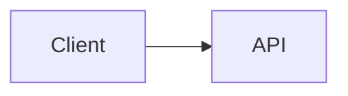

<div align="center">

# 🚀 MarkdownFly (mfly)

**面向开发者的 Markdown 转 PowerPoint (.pptx) CLI 工具。**  
用 Markdown 写幻灯片，内置语法高亮和图表渲染。  
几秒内生成美观、可二次编辑的 `.pptx`。

[](https://www.npmjs.com/package/markdownfly)
[](https://www.npmjs.com/package/markdownfly)
[](./LICENSE)
[](https://nodejs.org)

[English](./README.md) · [简体中文](./README_CN.md)

</div>

---

<details>
<summary>📖 目录</summary>

- [✨ 功能特性](#-功能特性)
- [📦 安装](#-安装)
- [🚀 快速上手](#-快速上手)
- [🎨 内置主题](#-内置主题)
- [📝 Markdown 语法指南](#-markdown-语法指南)
  - [幻灯片分割规则](#幻灯片分割规则)
  - [Frontmatter 配置](#frontmatter-配置)
  - [幻灯片内布局（网格）](#幻灯片内布局网格)
  - [幻灯片指令](#幻灯片指令-)
  - [Callout 卡片](#callout-卡片)
  - [任务清单](#任务清单)
  - [图片](#图片)
  - [语法高亮代码块](#语法高亮代码块)
  - [图表代码块](#图表代码块)
  - [注脚说明](#注脚说明)
- [🧪 测试](#-测试)
- [🤔 为什么选择 MarkdownFly？](#-为什么选择-markdownfly)
- [⭐ Star 趋势](#-star-趋势)
- [📄 许可证](#-许可证)

</details>

---

## ✨ 功能特性

- 📑 **Markdown 转 PowerPoint**：将标准 Markdown 转换为可编辑的 16:9 宽屏 `.pptx` 幻灯片。
- 🎨 **语法高亮**：由 [Shiki](https://shiki.style/) 驱动的 Token 级代码高亮（Python、TypeScript、Go、Rust、Java、C++、Bash、SQL 等 20+ 语言）。
- 📊 **内置图表渲染（零原生二进制依赖）**：
  - **Mermaid**：流程图、时序图、状态图、类图。
  - **Graphviz / DOT**：网络图、有限状态机、架构拓扑（via WASM）。
  - **PlantUML**：时序、类、活动、状态、组件和用例图（TeaVM 编译引擎 — 无需 JVM）。
  - **ECharts**：直接从 JSON 选项生成柱状图、折线图、饼图（via ECharts SSR）。
- 🖼️ **图片嵌入**：本地文件路径、远程 URL（`http://`/`https://`）和 base64 Data URI。
- 📐 **自动布局检测**：标题页、章节分隔、代码展示、引用和内容幻灯片。
- ⚡ **批量转换**：支持 glob 表达式批量转换（`mfly *.md`）。

---

## 📦 安装

需要 Node.js 20+。

```bash
# 全局安装（推荐）
npm install -g markdownfly

# 无需安装，直接运行
npx markdownfly@latest slides.md
```

从源码开发：

```bash
# 克隆并安装依赖
git clone https://github.com/Kyvin-Guan/markdownFly.git
cd markdownFly
pnpm install
pnpm build
```

链接到全局 CLI：
```bash
pnpm link --global
```

---

## 🚀 快速上手

### 基础用法

```bash
# 转换单个文件（输出文件名与输入一致：slides.md → slides.pptx）
mfly slides.md

# 指定主题（blue, ocean, ocean-dark）
mfly slides.md -t blue
mfly slides.md -t ocean-dark

# 指定自定义输出路径
mfly slides.md -t blue -o presentation.pptx

# 批量转换多个 Markdown 文件
mfly docs/*.md
```

若默认输出文件名已存在，会自动使用带时间戳的文件名（`slides-20260907-131500.pptx`）而非覆盖。使用 `-o` 时会直接覆盖目标文件。

### 自动化（`--quiet` / `--json`）

```bash
# 机器可读结果（stdout 输出一行 JSON；诊断信息输出到 stderr）
mfly slides.md --json

# 抑制每个文件的进度输出
mfly docs/*.md --quiet
```

- `--json` 在 stdout 输出单个 JSON 对象：
  `{"ok":true,"durationMs":1234,"files":[{"input":"slides.md","output":"C:/abs/slides.pptx","ok":true}]}`。
  单文件失败时 `ok:false` 并附带 `error` 字段。
- 仅当**所有**文件转换成功时退出码为 `0`；任意文件失败则退出 `1`（stderr 输出汇总行）。
- `-t` 指定未知主题名时以退出码 `1` 失败（Markdown frontmatter 中的未知主题名会回退到默认主题 `blue` 并输出警告）。
- 进度信息输出到 stderr；错误和警告始终输出到 stderr。

---

## 🎨 内置主题

`-t` / frontmatter `theme:` 使用**主题名**。解析顺序：**主题预设 → 色彩方案**。

| 主题名 | 类型 | 色彩 | 文字 | 版式 | 适合场景 |
| :--- | :--- | :--- | :--- | :--- | :--- |
| **`blue`** *(默认)* | 预设包 | `ocean` | `academic`（宋体） | `legacy` | 默认完整主题 |
| `ocean` | 仅色彩 | 深海墨蓝 `#1E4A6F` / 近白海沫 `#F0F8FF`；主 `#4F9FD9` / 辅 `#2D6A9F` | 默认 `system` | 不启用版式方案 | 只要换色时 |
| `ocean-dark` | 仅色彩 | 浅沫 `#D6E7F5` / 深海 `#0B1C2E`；主 `#5BAAE8` / 辅 `#8BBCDD` | 默认 `system` | 不启用版式方案 | 夜场深色演示 |

- 不写 `-t` / `theme` 时使用默认主题 **`blue`**。
- 主题预设 = 一次选齐色彩 × 文字 × 版式；色彩方案名仍可用于「只改颜色」。
- 库 API 可通过 `registerThemePreset` / `registerColorScheme` / `registerTextScheme` / `registerLayoutScheme` 扩展。

---

## 📝 Markdown 语法指南

### 幻灯片分割规则

- `---`（水平线）：主要幻灯片分隔符。
- `# 一级标题`：创建带**标题（封面）**布局的新幻灯片。
- `## 二级标题`：创建带**内容**或**章节**布局的新幻灯片。

### Frontmatter 配置

```yaml
---
theme: blue # 可选：blue（默认预设）, ocean, ocean-dark
author: "你的名字"
footer: "保密 - {page} / {total}" # {page}/{total}/{section}/{title}
resource_dir: ./assets # 相对图片路径的基础目录
layout: code # 内容幻灯片的可选默认布局
---
```

### 幻灯片内布局（网格）

用单独的标记行将幻灯片分割为多列/多行 — 无需额外标记：

````markdown
## 架构概览

### 架构图

<->                   <!-- 左右分栏：左边放图 -->

### 关键点
- 低延迟
- 可扩展
- 成本可控
===                   <!-- 上下分块：下面是另一行内容 -->

### 总结
> [!TIP]
> `===` 让一页拆成上下块，适合前后对比。
````

- `<->`（独立行）：水平分隔符 → **分栏**（并排显示）。
- `===`（独立行）：垂直分隔符 → **分行**（上下堆叠）。
- 两者组合可创建网格。代码块内的标记不会被解析。

### 幻灯片指令 `@(...)`

在幻灯片底部写一行单独的 `@(key=value, ...)` 来设置该幻灯片的选项：

```markdown
## 表格变图表

| 季度 | 订单量 |
| :--- | :--- |
| Q1 | 320 |
| Q2 | 580 |

@(chart=bar, notes=这里口头展开Q1-2数据)
```

| 指令 | 值 | 效果 |
| :--- | :--- | :--- |
| `layout` | `title` / `section` / `content` / `code` / `quote` | 覆盖自动检测的布局 |
| `notes` | 文本 | 该幻灯片的演讲者备注 |
| `chart` | `bar` / `line` / `pie` | 将第一个表格渲染为图表 |
| `highlight` | `2-4,6` | 高亮幻灯片代码块中的指定行 |
| `background` | URL/路径 | 幻灯片背景图片 |
| `steps` | `true` | 渐进式展示（保留功能） |

### Callout 卡片

```markdown
> [!NOTE]
> 需要记住的重要信息。

> [!TIP]
> 有用的建议。

> [!WARNING]
> 需要注意的内容。
```

支持的变体：`NOTE` / `INFO` / `TIP` / `SUCCESS` / `WARNING` / `CAUTION` / `DANGER` — 渲染为主题风格的强调卡片。

### 任务清单

```markdown
- [x] 已完成项目
- [ ] 待办项目
```

### 图片

单独的图片行会渲染为幻灯片元素（保持宽高比，在列中居中）。路径相对于 Markdown 文件解析，或相对于 `resource_dir`（本身相对于 Markdown 文件解析，而非当前工作目录）；远程 URL（`http/https`）和 base64 data URI 同样支持。缺失或失败的图片会跳过并在 stderr 输出警告 — 文档仍会正常生成。

```markdown
{w=6in,align=center}
{w=60%}
{width=120px,height=40mm,align=right}
```

- 键名：`w`/`width`、`h`/`height`、`align`（`left`/`center`/`right`，默认 `center`）
- 单位：`px`（默认）、`pt`、`cm`、`mm`、`in`/`inch`、`%`（相对于列宽；单一值时保持宽高比）
- 无效参数会被静默忽略 — 图片仍会正常渲染
- 格式：`png`、`jpg`/`jpeg`、`gif`、`webp`、`bmp`、`svg`。alt 文本会写入 PPTX，因此 `` 就是屏幕阅读器朗读的内容。
- ⚠ `webp` 会原样存储，但并非所有阅读器都能解码 — PowerPoint for the web 和 Office 2019 及更早版本会显示图片损坏。stderr 会输出警告。
- `svg` 在嵌入时会光栅化为 PNG（宽 1200px），在所有阅读器中渲染一致。会保留作者的原始框架，包括 viewBox 中内置的任何边距。代价是：文档携带的是栅格而非矢量，不再无损缩放，且 SVG 较多的文档体积更大。
- ⚠ 安全：图片路径（`` 和 `@(background=...)`）解析时无任何限制 — 请只转换您自己拥有或信任的 Markdown。

### 语法高亮代码块

`````markdown
````typescript
interface User {
  id: string;
  name: string;
}

function greet(user: User): string {
  return `Hello, ${user.name}!`;
}
````
`````

`````markdown
````python
def quick_sort(arr): ...
````
@(highlight=1,3-4)   <!-- 高亮指定行 -->
`````

### 图表代码块

`````markdown
````mermaid
graph TD
    A[Client] --> B[API Gateway]
    B --> C[Auth Service]
    B --> D[Data Service]
````

````dot
digraph Architecture {
    rankdir=LR;
    node [shape=box, style=filled, fillcolor=lightblue];
    Frontend -> Backend -> Database;
}
````

````echarts
{
  "xAxis": { "type": "category", "data": ["Q1", "Q2", "Q3", "Q4"] },
  "yAxis": { "type": "value" },
  "series": [{ "data": [150, 230, 224, 218], "type": "bar" }]
}
````

````plantuml
@startuml
Alice -> Bob : 登录请求
Bob --> Alice : 登录成功
@enduml
````
`````

支持的图表语言：`mermaid`、`dot`（别名 `graphviz`）、`echarts`、`plantuml`（别名 `puml`）。
图表幻灯片遵循演示主题，包括其暗色配色方案。

PlantUML 说明：

- `@startuml`/`@enduml` 包裹是可选的 — 裸源码会自动添加包裹，未闭合的 `@startuml` 也会自动补全。
- `!theme` 不可用（打包的引擎不包含主题文件）；请改用 `skinparam`。该指令会跳过并输出警告，而不会导致图表失败。
- 设置 `MFLY_DEBUG=1` 可将 PlantUML 引擎的内部日志转发到 stderr；默认静音以避免干扰 stdout。
- 图表错误不会导致文档生成失败：受影响的幻灯片会显示红色占位符，演示文档其余部分仍会正常生成。

### 注脚说明

- 单独的 `===` 始终表示行分隔 — setext 风格标题（`标题` + `===`）在 mfly 中等同于 `# 一级标题`。
- 单独的 `<->` 始终表示列分隔；使用 `***text***` 表示粗斜体（moffee 约定的 `<->粗斜体<->` 写法故意未采用，以避免歧义）。

---

## 🧪 测试

```bash
# 运行所有单元测试和集成测试
pnpm test
```

---

## 🤔 为什么选择 MarkdownFly？

| 功能 | **MarkdownFly** | Marp | Slidev | reveal.js |
| :--- | :---: | :---: | :---: | :---: |
| 输出格式 | ✅ `.pptx`（可编辑） | PDF / HTML | HTML | HTML |
| 无需浏览器 / headless Chrome | ✅ | ❌ | ❌ | ❌ |
| 零原生二进制依赖 | ✅ | ❌ | ❌ | ❌ |
| Mermaid / Graphviz / PlantUML / ECharts | ✅ 全部支持 | 仅 Mermaid | 仅 Mermaid | ❌ |
| CLI 优先，CI/CD 友好 | ✅ | ✅ | ⚠️ | ❌ |
| 语法高亮代码块 | ✅ Shiki | ✅ | ✅ | ⚠️ |
| 导出后幻灯片可二次编辑 | ✅ | ❌ | ❌ | ❌ |
| 幻灯片内网格布局 | ✅ `<->` / `===` | ❌ | ⚠️ | ❌ |

> **一句话总结** — MarkdownFly 是唯一能输出**原生可编辑 `.pptx`**、支持全套图表且**零原生二进制依赖**的工具。

---

## ⭐ Star 趋势

<div align="center">

[](https://star-history.com/#Kyvin-Guan/markdownFly&Date)

</div>

---

## 📄 许可证

MIT License © 2026 MarkdownFly Contributors

---

<div align="center">

Made with ❤️ by [MarkdownFly Contributors](https://github.com/Kyvin-Guan/markdownFly/graphs/contributors)

</div>
