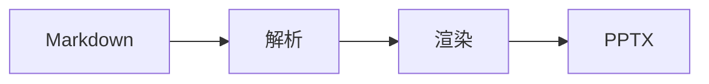
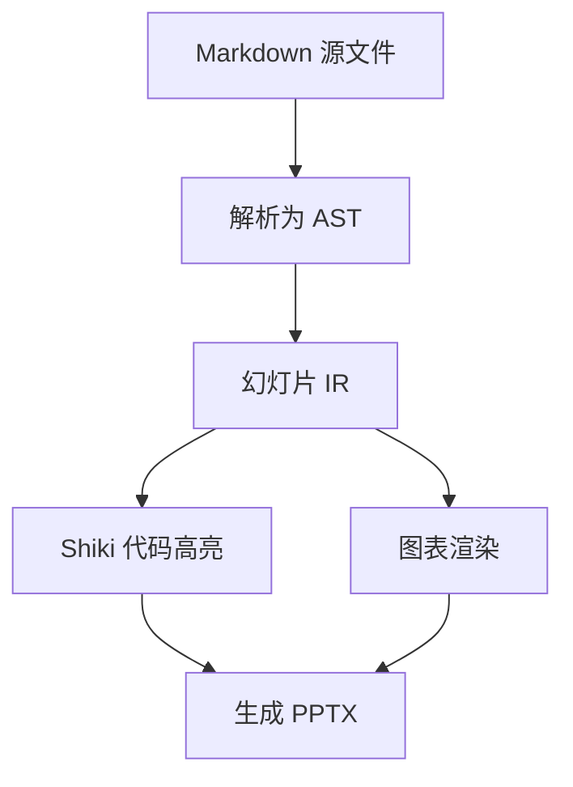
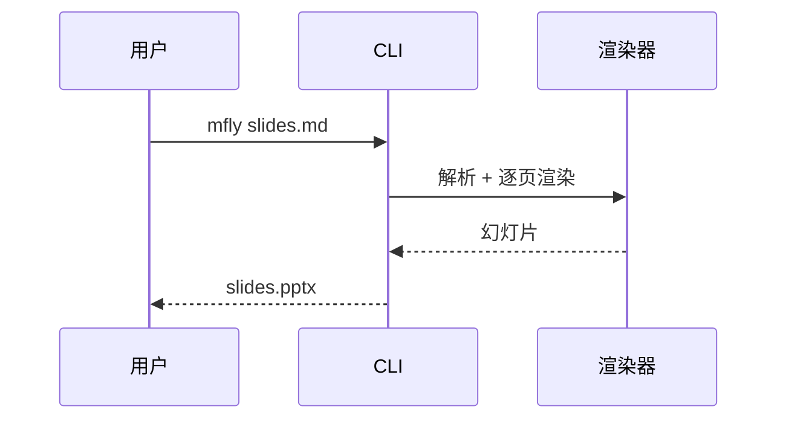
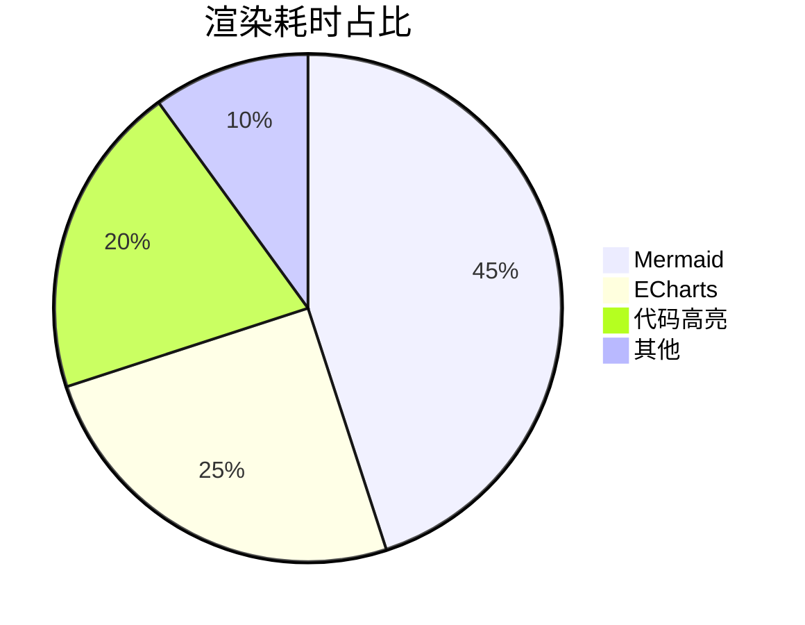
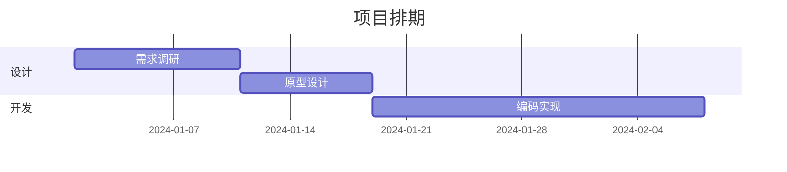
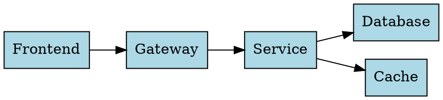
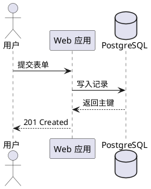
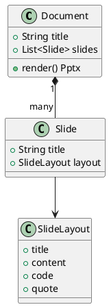

# MarkdownFly
## 一份 Markdown,一份可编辑的 PPTX

%%

## 这份文档是什么

这是 mfly 的**全特性演示**——每一页都在演示一项真实能力,可以直接生成一份可编辑的 PPTX:

```bash
mfly showcase.md
```

- 本文件设置了 `resource_dir: test/fixtures`,所以下面图片用的是短路径
- 页脚中的 `{section}`、`{page}`、`{total}` 就是本页底部那一行

%%

## 目录

- 基础排版 · 任务清单 · Callout · 代码高亮
- 分栏 / 分块 / 网格嵌套
- 表格转图表 · Mermaid · Graphviz · ECharts · PlantUML
- 图片:本地 / 远程 / Data URI / SVG / 尺寸与对齐
- 幻灯片指令 · 演讲者备注 · 背景 · 版式覆盖 · 主题

---

## 基础排版

普通段落,支持 **粗体**、*斜体*、***粗斜体*** 与 `行内代码`。

无序列表:

- 第一项
- 第二项,可以嵌套
  - 子项

有序列表:

1. 第一步
2. 第二步

> 普通引用块(没有 `[!TYPE]` 标记时,按引用样式渲染)。

| 语法 | 效果 |
| :--- | :--- |
| `## 标题` | 新建一页内容幻灯片 |
| `---` | 幻灯片分隔线 |
| GFM 表格 | 自动套用主题配色 |

## 任务清单

- [x] 已完成的事项(打勾并变为次要色)
- [x] 另一项已完成
- [ ] 待办事项

任务清单用 GFM 语法,完成项会显示 ☑ 并弱化颜色。

## Callout 提示框

> [!NOTE]
> 补充说明,适合放定义或前提。

> [!TIP]
> 实用技巧,适合放最佳实践。

> [!WARNING]
> 需要注意的风险点。

支持 7 种变体:`NOTE` / `INFO` / `TIP` / `SUCCESS` / `WARNING` / `CAUTION` / `DANGER`,各自有独立的强调色。

## 代码高亮

代码块按语言用 Shiki 做 token 级着色,支持 20+ 语言。

```typescript
interface Slide {
  title: string;
  layout: 'title' | 'content' | 'code' | 'quote';
}

function render(slide: Slide): string {
  return `[${slide.layout}] ${slide.title}`;
}
```

```python
def quick_sort(xs):
    if len(xs) <= 1:
        return xs
    pivot = xs[len(xs) // 2]
    return (
        quick_sort([x for x in xs if x < pivot])
        + [x for x in xs if x == pivot]
        + quick_sort([x for x in xs if x > pivot])
    )
```

## 高亮指定代码行

用 `@(highlight=...)` 指定要强调的行(支持 `2`、`2-4`、`2,5-6` 这样的写法)。

```python
def quick_sort(xs):
    if len(xs) <= 1:
        return xs
    pivot = xs[len(xs) // 2]
    return (
        quick_sort([x for x in xs if x < pivot])
        + [x for x in xs if x == pivot]
    )
```

@(highlight=2,6-7)

## 分栏布局 `<->`

单行 `<->` 把一页拆成左右两栏,列宽自动等分。

### 左栏 · 要点

- 写 Markdown,不用记版式
- 自动识别标题页、章节页、代码页
- 输出是可编辑的 PPTX,不是图片

<->

### 右栏 · 收益

- 版本可控,能进 Git
- 图表即代码,改数据就改图
- 批量转换整个目录

## 分块布局 `===`

单行 `===` 把一页拆成上下两块,适合做前后对比。

上半部分:改写前

- 手工排版,一处改动全页返工
- 图表是贴图,数据变了要重做

===

下半部分:改写后

- 内容即源码,改一行就好
- 图表由数据生成,永远一致

## 分栏 + 分块可以嵌套

先用 `===` 分成上下,再在每一块里用 `<->` 分左右。

### 架构



<->

### 说明

- 左图右文是最常见的组合
- 网格可以任意嵌套

===

> [!TIP]
> 行内的 `===` 与 `<->` 只在**独立成行**时才是布局标记;写在代码块里不受影响。

## 表格转柱状图 `@(chart=bar)`

不用写图表 JSON——把表格交给 `@(chart=...)` 就行。第一列是类目,其余每列是一条数据系列。

| 季度 | 订单量 | 营收 |
| :--- | :--- | :--- |
| Q1 | 320 | 45 |
| Q2 | 580 | 72 |
| Q3 | 750 | 90 |
| Q4 | 910 | 128 |

@(chart=bar)

## 表格转折线图 `@(chart=line)`

| 月份 | 新增用户 | 活跃用户 |
| :--- | :--- | :--- |
| 1月 | 120 | 340 |
| 2月 | 180 | 400 |
| 3月 | 150 | 470 |
| 4月 | 240 | 560 |

@(chart=line)

## 表格转饼图 `@(chart=pie)`

饼图用第一列作名称、第二列作数值。

| 来源 | 占比 |
| :--- | :--- |
| 搜索引擎 | 46 |
| 直接访问 | 28 |
| 社交媒体 | 18 |
| 其他 | 8 |

@(chart=pie)

## Mermaid · 流程图

````markdown

````


## Mermaid · 时序图



## Mermaid · 饼图



## Mermaid · 块图


## Mermaid · 甘特图



## Graphviz / DOT

`dot` 与 `graphviz` 两种语言名都可用,布局由 WASM 版 Graphviz 计算。



## ECharts · 原生 JSON

需要更细的控制时,直接写 ECharts option。`width` / `height` 会被当作画布尺寸读取。

```echarts
{
  "xAxis": { "type": "category", "data": ["Q1", "Q2", "Q3", "Q4"] },
  "yAxis": { "type": "value" },
  "legend": { "data": ["订单量", "营收"] },
  "series": [
    { "name": "订单量", "type": "bar", "data": [320, 580, 750, 910] },
    { "name": "营收", "type": "line", "data": [45, 72, 90, 128] }
  ]
}
```

## PlantUML · 时序图

PlantUML 用官方 TeaVM 编译的引擎,**不需要 JVM**,也不需要 Graphviz 二进制。



## PlantUML · 类图

语言名 `plantuml` 与别名 `puml` 都可用。类图这一类用 PlantUML 的效果最完整。



## 图片 · 本地路径

`resource_dir` 已设为 `test/fixtures`,所以这里可以直接写文件名。

{w=4in}

尺寸参数写在图片后的 `{...}` 里;不写就按列宽等比缩放。

## 图片 · 尺寸与对齐

`w`/`width`、`h`/`height`、`align` 三个键,支持 `px`(默认)、`pt`、`cm`、`mm`、`in`、`%`。只给一个方向时,另一边按原图比例推导。

{w=40%,align=left}

{width=120px,height=90px,align=right}

<->

{w=2in,align=center}

参数非法时会被忽略,图片照常渲染。

## 图片 · 远程 URL

`http://` 与 `https://` 会自动下载后嵌入,10 秒超时。

{w=3in,align=center}

离线时会提示并跳过这一张,其余内容照常生成。

## 图片 · Data URI 与 SVG

`data:image/...;base64,...` 可以直接内联。下面这张是内联 SVG——SVG 会在嵌入前按 1200px 宽**光栅为 PNG**,所以任何阅读器都能显示,代价是失去矢量缩放。

{w=2.5in,align=center}

## 图片格式支持

| 格式 | 说明 |
| :--- | :--- |
| `png` / `jpg` / `jpeg` | 原生支持,按文件头读取真实尺寸 |
| `gif` / `bmp` | 原生支持 |
| `svg` | 嵌入前光栅为 1200px PNG,保留作者留白 |
| `webp` | 原样嵌入;网页版 PowerPoint 与 Office 2019 及更早无法解码,转换时会提示 |
| 缺失 | 跳过并告警,整份 deck 仍会生成 |

图片的替代文本会写进 PPTX,`` 就是屏幕阅读器读到的内容。

## 幻灯片指令速查

`@(...)` 必须是独立一行,通常放在该页末尾。

| 指令 | 取值 | 作用 |
| :--- | :--- | :--- |
| `layout` | `title` / `section` / `content` / `code` / `quote` | 覆盖自动识别出的版式 |
| `notes` | 文本 | 写入演讲者备注 |
| `chart` | `bar` / `line` / `pie` | 把本页第一个表格渲染成图表 |
| `highlight` | `2-4,6` | 高亮代码块中指定行 |
| `background` | `#RRGGBB` / 路径 / URL | 覆盖本页背景 |
| `steps` | `true` | 逐条显示(保留项,暂未生效) |

值里含逗号或括号时要用引号包起来:`@(notes="带,逗号,也能写")`。未加引号时逗号会被当作下一个键值对的分隔符。

## 演讲者备注

备注不会出现在幻灯片上,只写进 PPTX 的备注区,放映时在演讲者视图可见。

```typescript
const layout = detectLayout(elements);
```

@(notes="这里口头展开:版式是自动识别的,只有需要覆盖时才写 layout 指令。")

值里含逗号或括号时用引号包起来——否则逗号会被当成下一个键值对的分隔符。

## 背景覆盖

用 `@(background=#EEF2FF)` 覆盖本页背景,也可以传图片路径或 URL。

@(background=#EEF2FF)

## 引用版式

用 `@(layout=quote)` 把一页强制成引用版式,适合放金句或结论。

> 幻灯片的价值在于内容,不在于排版。
> 把排版交给工具,把注意力留给观点。

@(layout=quote)

## 纯代码版式

整页只有代码块时自动识别为代码版式;也可以用 `@(layout=code)` 强制指定。

```bash
# 单文件转换,输出与源文件同名
mfly slides.md

# 指定主题与输出路径
mfly slides.md -t academic -o deck.pptx

# 批量转换整个目录
mfly docs/*.md --quiet
```

@(layout=code)

## 注释与转义

以 `%%` 开头的独立行会被整行删除,用来放不会出现在成品里的草稿。

%% 这行不会出现在幻灯片上

- `---` 是分页符
- 独立成行的 `===` 是上下分块,不会被当成标题下划线
- 独立成行的 `<->` 是左右分栏
- 以上标记写在代码块内一律不生效

## 内置主题

用 `-t <名称>` 切换,共 11 套。

| 主题 | 风格 | 适用 |
| :--- | :--- | :--- |
| `clean` | 现代清爽(默认) | 通用技术分享 |
| `academic` | 学术 LaTeX | 论文、答辩 |
| `dark` | 暗色极客 | 开发者聚会、终端演示 |
| `business` | 商务专业 | 汇报、评审 |
| `warm` | 暖纸质感 | 主题演讲、回顾 |
| `aurora` / `neon` / `nord` / `dracula` | 深色渐变与霓虹 | 产品发布、创意 |
| `beige` / `ink` | 暖纸 / 水墨 | 编辑类、人文主题 |

图表、背景与文字会一起跟随主题切换。

## 命令行

```bash
mfly <files...> [选项]

  -o, --output <path>   指定输出路径(仅单文件)
  -t, --theme <name>    指定主题
      --quiet           不输出逐文件进度
      --json            向 stdout 输出一行机器可读结果
```

- 默认输出与源文件同名;已存在时自动加时间戳,不覆盖
- `-t` 传入未知主题会以退出码 1 失败
- 任一文件失败则整体退出码为 1,其余文件继续转换
- 进度与警告走 stderr,stdout 只留给结果

---

## 谢谢观看 · 用 Markdown 写幻灯片
