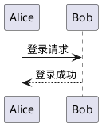

# 语法演示
## 分栏 · 分块 · Callout · 图表

---

## 分栏示例

### 架构图

<->

### 核心要点
- 左图右文
- 自动等分列宽
- 支持嵌套

---

## 分块示例

上半部分:前后对照

===

下半部分:总结

> [!TIP]
> `===` 让一页拆成上下两块,适合"方案对比"。

---

## 任务清单与 Callout

- [x] 支持分栏 `<->`
- [x] 支持分块 `===`
- [ ] 支持数学公式(规划中)

> [!WARNING]
> 进度依赖环境。

---

## 表格变图表

| 季度 | 订单量 | 营收 |
| :--- | :--- | :--- |
| Q1 | 320 | 45 |
| Q2 | 580 | 72 |
| Q3 | 750 | 90 |

@(chart=bar)

---

## PlantUML 时序图



---

## 高亮代码行

```typescript
function greet(user: User): string {
  return `Hello, ${user.name}!`;
}
```

@(highlight=2)

---

# 结束 · Q&A
## 谢谢观看
